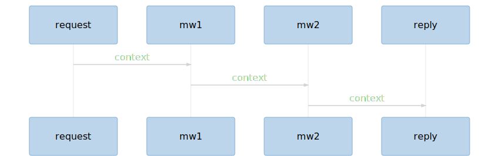

<footer>
<object 
    class="logo"
    data="./public/github.svg" type="image/svg+xml">
</object> [yanick](https://github.com/yanick) <object 
    class="logo"
    data="./public/twitter.svg" type="image/svg+xml">
</object> [yenzie](https://twitter.com/yenzie)
</footer>

<!-- .slide: id="title" -->

<figure class="title">

<figcaption>I have such sights to show you...</figcaption>
</figure>

<h2>New JavaScript experiences for the jaded Perler </h2>

Yanick Champoux 

<object 
    class="logo"
    data="./public/github.svg" type="image/svg+xml">
</object> [yanick](https://github.com/yanick) <object 
    class="logo"
    data="./public/twitter.svg" type="image/svg+xml">
</object> [yenzie](https://twitter.com/yenzie)

for Toronto.pm, October 25th, 2018

# I was bored 

*uh oh*

##v and wanted to learn bleeding edge JavaScript 

*uh oh intensifies*

##v Let's implement a game! 

<figure style="float: left">

</figure>

[Full Thrust][]

kinda like

Battletech & Warhammer 4K

but in *spaaaaaaace*

##v A year passes...

##v


### At the end of this talk, you'll

* be flabbergasted & midly dizzy 
* have been name-dropped enough JS libraries to leave bruises
* learn of the existence of some Perl counter-parts 
* hopefully be left with a newfound morbid hunger to know more 

## Four parts 

* general tooling
* game engine 
* RESTish service 
* Web UI

# part I: The trimmings 

<!-- # trimmings -->

<!-- .slide: data-background-image="./public/trimmings.jpg" -->
<!-- .slide: data-background-opacity="0.25" -->

## Slides

<!-- ## slides -->


* [Reveal.js][] - looks pretty! But have to write HTML page
* [App::Chorus][] - write in Markdown! Some websocket support
* [reveal-md][] - ditto, but not for me to maintain! \o/

!!!

* Reveal let you write in Markdown \o/ ... but inside a web page. Blergh.
* App::Chorus massage Markdown into the webpage format + add websockets 
* reveal-md does the same, but better.

##v

    ## The trimmings 

    

    ## Slides

    * [Reveal.js][]
    * [App::Chorus][]
    * [reveal-md][]

##v 

invocation

```bash
$ reveal-md --watch --preprocessor groom.js \
            --css style.css tpm.md 
```

##v 

`groom.js`

```js 

const metacpan = text =>
  text.replace(
    /cpan:\/\//g, 
    "https://www.metacpan.org/pod/" 
);

module.exports = async ( markdown, options ) => {
    return metacpan( markdown );
}
```

    

## Diagrams 

<!-- ## diagrams -->

* [Graph::Easy][]
* [mermaid][] ( + mermaid.cli )

flowcharts, sequences, Gantt, classes, git 

##v

```
graph TD;

AotDS(AotDS) --> mermaid 
AotDS(AotDS) -- slides --> reveal-md 

AotDS -->|game server| aotds-server 

aotds-server(aotds-server) -->|game engine| aotds-battle
aotds-server -->|UI| aotds-app
aotds-server -->|db interaction| objection 

...
```


##v :-(

mermaid.cli uses [puppeteer][] and chromium, which is heavy.


!!!

Note: mermaid for within the webpage.

Note: mermaid.cli use puppeteer/chromium to generate the output. Not lightweight.

## Task runner 


<!-- ## task runner -->

<!-- .slide: data-background-image="./public/mangler.jpg" -->
<!-- .slide: data-background-size="400px" -->
<!-- .slide: data-background-position="right 20px" -->
<!-- .slide: data-background-opacity="0.35" -->

* Makefile
* scripts in `package.json`

##v

```js 
  "scripts": {
    "test": "jest src/",
    "build": "npm run test && npm run doc && npm ..."
  },

```

##v

* [Grunt][]
* [Gulp][] ([Pulp][])
* [runjs][]
    * very basic, no watch or file globbing 

##v 

```
const { run } = require('runjs');

const config = {
    markdown_file: './tpm-2018-10.md'
};


function showtime () {
    run( `reveal-md ... ${ config.markdown_file }` );  
}


module.exports = { showtime };

```

##v 

```bash 
$ run showtime

```

##v

so at the end, I went with... [go-task][]


##v

```yml
version: 2

vars:
  slides: tpm-2018-10.md

tasks:
  showtime:
    desc: SHOWTIME BABY!
    cmds:
      - reveal-md ... {{ .slides }}
```

##v no foreach loop :-(

```yaml
graphs:
    desc: turn mermaid graphs into svgs
    deps: 
        - task: graph 
          vars: { graph: stack.mmd }
        - task: graph 
          vars: { graph: other.mmd }

```

## package manager 


<!-- ## package manager -->

* cpan, cpanplus, cpanm
* npm
* yarn
* [pnpm][]

## Babel 


<!-- ## babel -->

<!-- .slide: data-background-image="./public/babel.jpg" -->
<!-- .slide: data-background-opacity="0.35" -->

##v 

<div class="height: 400px; width: 200px;">

</div>

[Keyword::Simple][], Filter::*

##v


##v 


##v

think of it as [Dist::Zilla][] for JS code

##v

`.babelrc`

```js 
{
  "plugins": [ 
    ["@babel/plugin-proposal-pipeline-operator", 
      { "proposal": "minimal" } 
    ],
    [ "module-resolver", { "alias": { "~": "./src" } } ],
  'transform-decorators-legacy',
  ],
  "presets":[
    [ "env", { "targets": { "node": "current" } } ], 
    "stage-1", 
    "stage-0" 
  ]
}
```

##v

```bash 
$ babel src/* -o lib/
```

## Webpack 


<!-- ## webpack -->

[App::FatPacker][]

<!-- .slide: data-background-image="./public/harkonnen.jpg" -->
<!-- .slide: data-background-opacity="0.35" -->

##v

```js
const webpack = require('webpack');

module.exports = {
  entry: [ 
    'babel-polyfill', 
    'react-hot-loader/patch',
    './src/index.jsx' 
  ],
  output: {
    path: './dist',
    publicPath: '/',
    filename: 'bundle.js'
  }
}  
```

## part II: Game Engine 


<!-- # part II: game engine -->


## [lodash][]


<!-- ## lodash -->

> You can write JavaScript without LoDash the same way you can eat your meal without cutlery.

##v

[List::Util][], [List::MoreUtils][], [Scalar::Util][], [Ref::Util][] all
rolled into one.

&nbsp;

functional programming interface via `lodash/fp` -- like [Ramda][] minus the pretentiousness.

## [debug][]

<!-- ## debug -->


<!-- .slide: data-background-image="./public/bug.jpg" -->
<!-- .slide: data-background-opacity="0.25" -->
<!-- .slide: data-background-size="400px" -->
<!-- .slide: data-background-position="right" -->


##v

```js 
const debug = require('debug')('aotds:engine');

...

debug( "what the? %o", my_object );

```

##v 

```bash 
$ DEBUG="aotds:*,-aotds:else" node scripts.js
```


## [Redux][]


<!-- ## redux -->

([Pollux][])

##v

* state described by store, a plain data structure 
* actions + old state = new state 
* reducing is pure function (no side-effects, no randomness)

##v

```js
{ ships: [ 
    { id: 'enkidu', status: { destroyed: false } },
    { id: 'siduri', status: { destroyed: false } },
]}
```

##v 

```js 
{ type: 'EXPLOSION', ship_id: 'enkidu' }
```

##v 

```js
{ ships: [ 
    { id: 'enkidu', status: { destroyed: true } },
    { id: 'siduri', status: { destroyed: false } },
]}
```


##v 

* can flash-freeze current state 
* list of actions, list of states, you have the world

##v


##v

[Redux Saga][]

<!-- ## redux saga -->

* middleware framework 
* helps with juggling of async actions
* helps with testing 
* doesn't work with immutable actions :-(


## [updeep][]

<!-- ## updeep -->

Immutable-friendly deep merging library.

##v

```js
store.ships = store.ships.map( 
    ship => ship.id == 'enkidu' 
        ? fp.merge({ status: { destroyed: true } } )(ship)
        : ship
);
```

##v

```js 

const is_right_ship = fp.has({ id: 'Enkidu' });
const it_is_a_goner = { status: { destroyed: true } };

store = u({
    ships: u.map(
        u.if( is_right_ship, it_is_a_goner )
    )
}, store );
```

## schema description 


<!-- ## json schema -->

to document and validate

* [typescript][]
* [flow][]
* [json schema][]

##v JSON schema 

* not at compile-time like TypeScript and Flow
* Swagger types is a subset of JSON Schemas
* typing can refer to values in the structure itself 

```js 
{
  engine: {
     max_thrust: 4,
     thrust: 2,
  }
}
```

##v

```js
navigation = {
  "type": "object",
  "properties": {
    "thrust": { "type": "number" },
    "turn": { "type": "number" },
    "bank": { "type": "number" }
  }
};
```

##v boilerplate schmoilerplate

[json-schema-shorthand][]

```js 
navigation: object({
  thrust: number(),
  turn:   number(),
  bank:   number(),
}),
```

## JSON Schema visualization 

* [docson][]

##v


## testing 


<!-- ## testing -->

TAP, [Test::More][], [Test::Most][]

[TAPE][]


[mocha][] + [chai][]

##v

<!-- .slide: data-background-image="./public/lotion.png" -->
<!-- .slide: data-background-position="right" -->
<!-- .slide: data-background-size="200px" -->

```js
it( 'rubs the lotion', () => {
    expect( this.hose() ).toBeTrue();
});
```

##v [jest][]

<!-- .slide: data-background-image="./public/joker.jpg" -->
<!-- .slide: data-background-opacity="0.25" -->
<!-- .slide: data-background-size="800px" -->
<!-- .slide: data-background-position="right" -->

* test framework, cli, expect stuff bundled together
* can watch files for changes, do coverage, run tests for touched files
* can use `test` instead of `it`

## documentation 


<!-- ## docs -->

> the 90s called, they want their READMEs back 

<!-- .slide: data-background-image="./public/cavemen.jpg" -->
<!-- .slide: data-background-opacity="0.25" -->

##v

[jsdoc][], [esdoc][], [gitbook][]


## part III: RESTish service 


<!-- # part III: RESTish service -->

## 

service definition 


<!-- ## swagger -->

[Swagger][]

##v

```yaml
/battle/{battle_id}/ship/{ship_id}/orders:
    post:
        parameters:
            - name: battle_id
              in: path
              type: string
              required: true
            - name: ship_id
              in: path
              type: string
              required: true
        description: dispatch orders to ship
        responses:
            200:
                description: orders sent to ship
```

##v


##v

[Dancer2::Plugin::Swagger2][], [Dancer2::Plugin::OpenAPIRoutes][]

[Dancer::Plugin::Swagger][]

[koa-oai-router-middleware][]

## web app framework 

<!-- ## koa -->

* [Dancer2][], [Mojolicious][], [Catalyst][]
* [express][]
* [koa][]

##v 

errything is middleware 

<!-- .slide: data-background-image="./public/all-the-things.png" -->
<!-- .slide: data-background-opacity="0.25" -->




##v 

```js
export const post_orders = async(ctx,next) => {
    let { battle_id, ship_id } = ctx.params;
    let orders = ctx.request.body;

    let battle = await retrieve_battle(ctx,battle_id);
    battle.dispatch_action( 'set_orders', ship_id, orders );

    ctx.body = battle.state 
            |> fp.get( 'bogeys' )
            |> fp.find({ id: ship_id });

    _play_turn( battle );

    await next();
};
```

## Swagger route definition 

<!-- ## swagger route definition -->

thank you, `koa-oai-router-middleware`

```js 
/battle/{battle_id}/ship/{ship_id}/orders:
    post:
        x-oai-controller:
            - file: battle
              handler: post_orders 
```

## authorization

<!-- ## auth -->

* [jwt][] 
* [koa-jwt][]

##v

```
{
  "player_id": "yenzie",
  "is_admin": true,
}
```

!!!

Can be used for cli-based interfaces

##v

```
eyJhbGciOiJIUzI1NiIsInR5cCI6IkpXVCJ9.
eyJwbGF5ZXJfaWQiOiJ5ZW56aWUiLCJpYXQiOjE1Mzk5ODk4MjV9.
gyxrI1wtAypbkGc2UK34rHAcyhUe1fArPhMqp5QNXtQ
```


##v

```
header  eyJhbG...
payload  eyJwbG...
signature gyxrI1...
```

## [websockets][]

[ws][]

<!-- websockets -->

<!-- .slide: data-background-image="./public/shocker.jpg" -->
<!-- .slide: data-background-opacity="0.25" -->
<!-- .slide: data-background-size="400px" -->
<!-- .slide: data-background-position="right" -->

##v

```js
import WebSocket from 'ws';

class WSServer {

    constructor({ port }) {
        this.ws = new WebSocket.Server({ port });
        this.ws.on('connection', this.new_connection );
    }

    new_connection = ws => {
        ws.on( 'message', message => {
                ws.battle = JSON.parse(message).battle;
        });
    };

    new_turn = battle => {
        let message = JSON.stringify({ type: 'NEW_TURN_AVAILABLE' });

        Array.from(this.ws.clients.values()).filter( c => c.battle === battle ).forEach( ws => {
            ws.send(message)} );
    };
}
```


## Database


<!-- ## databases -->

[DBI][], [DBIx::Class][]

[knex][], [objection][]

!!!

Objection is very JSON-friendly 

##v

knex migration

```js 
exports.up = function (knex, Promise) {
    return knex.schema.createTable('game_turns', table => {
        table.string('name').notNullable();
        table.integer('turn').unsigned().notNullable();
        table.json('state').notNullable();
        table.primary(['name','turn']);
    })
};

exports.down = function down(knex, Promise) {
    return knex.schema.dropTable('game_turns');
};

```

##v


```
import { Model } from 'objection';

export default class Players extends Model {
  static tableName = 'players';
  static get idColumn() { return 'name'; }

  static async auth( name, password ) {
    let player = await Players.query().findById(name);
    await bcrypt.compare(password, player.password );

    return {
       player: name, is_admin: player.is_admin,
    };
  }
}
```

## actually, you know what? 

<h2>screw that db stuff </h2>

<!-- .slide: data-background-image="./public/flip.jpg" -->
<!-- .slide: data-background-opacity="0.15" -->
<!-- .slide: data-background-size="80%" -->

##v


```js
import { LocalStorage } from 'node-localstorage';

export default class Players {
  constructor(path) {
      this.storage = new LocalStorage('./player_store');
  }

  set( player ) { 
    this.storage.setItem( player.player_id, 
    JSON.stringify(player) );
  }

  async auth( name, password ) {
    let player = JSON.parse(this.storage.getItem(name));
    (...)
    return _.omit( player, [ 'password' ] );
  }
}
```

##v

```js 
import { AsyncNodeStorage } from 'redux-persist-node-storage';

const storage = new AsyncNodeStorage( './battle_store');

...;

reducer = persistReducer(
  { storage, key: "Epsilon 4" }, 
  reducer 
);
```


## part IV: Web UI 

<!-- # part IV: WEB UI -->

## Templating

<!-- ## react -->

browser-side dynamic [Mason][] / [Template Toolkit][]

[vuejs][]

[react][]


##v

`components/CommandPanel/Navigation.jsx`

```js
export default function Navigation({ 
    drive_rating, disabled, amend_orders, orders, maneuvers 
}) {
  return <FieldSet disabled={disabled} legend="navigation">
    { [ 'thrust', 'turn', 'bank' ].map( type => 
        <Maneuver
            drive_rating={ drive_rating }
            maneuver={ type }
            range={ _.get(maneuvers,type, [0,0])  }
            value={ _.get(orders,type, 0)  }
            disabled={disabled}
        /> ) }
    </FieldSet>
}
```

##v too exotic?

##v

[react-templates][]

```js 
<FieldSet disabled="{this.disabled}" legend="navigation">
    <Maneuver rt-repeat="type in [ 'thrust', 'turn', 'bank' ]"
        drive_rating="{ this.drive_rating }"
        maneuver="{ type }"
        range="{ _.get(this.maneuvers,type, [0,0])  }"
        value="{ _.get(this.orders,type, 0)  }"
        disabled="{this.disabled}"
    />
</FieldSet>
```


## UI component toolkit 


<!-- ## toolkits -->

> Why reinvent the wheel when you can steal it from the tire factory?

[blueprintjs][] - react, desktop-focused, good docs

## Graphics

* Canvas - js interface, in-browser
* SVG  - XML, style via css

### Stylin'


<!-- ## styling -->

css - the unavoidable base

[sass][] - styling dialect of its own

[postcss][] - think Babel, but for CSS

##v 

```js
module.exports = {
  plugins: [
    require('postcss-import')(),
    require('lost'),
    require('postcss-nesting')(),
    require('postcss-url')(),
  ],
}
```

##v

```
@import "from/somewhere/else"

.command_panel .head_section {
    display: flex;
    justify-content: flex-end;

    & .bogey_name {
        flex-grow: 1;
    }
}
```


## testing UI 


<!-- ## testing UI -->

[storybook][]

* manual testing 
* per-component development
* documentation / ref guide

<!-- .slide: data-background-image="./public/grimm.png" -->
<!-- .slide: data-background-opacity="0.25" -->
<!-- .slide: data-background-size="600px" -->
<!-- .slide: data-background-position="right" -->

##v


##

[websockets]: https://developer.mozilla.org/en-US/docs/Web/API/WebSockets_API
[Reveal.js]: https://revealjs.com/
[reveal-md]: http://webpro.github.io/reveal-md
[App::Chorus]: cpan://App::Chorus
[Graph::Easy]: cpan://Graph::Easy
[mermaid]: https://mermaidjs.github.io/
[puppeteer]: npm://puppeteer
[runjs]: npm://runjs
[Gulp]: npm://gulp
[Grunt]: npm://grunt
[go-task]: https://github.com/go-task/task
[Pulp]: http://techblog.babyl.ca/entry/pulp-fiction
[pnpm]: https://github.com/pnpm/pnpm 
[Keyword::Simple]: cpan://Keyword::Simple
[App::FatPacker]: cpan://App::FatPacker
[lodash]: npm://lodash
[Ramda]: https://ramdajs.com/
[List::Util]: cpan://List::Util
[List::MoreUtils]: cpan://List::MoreUtils
[Scalar::Util]: cpan://Scalar::Util
[Ref::Util]: cpan://Ref::Util
[updeep]: npm://updeep
[Swagger]: https://swagger.io/
[Dancer2::Plugin::Swagger2]: cpan://Dancer2::Plugin::Swagger2
[Dancer2::Plugin::OpenAPIRoutes]: cpan://Dancer2::Plugin::OpenAPIRoutes
[Dancer::Plugin::Swagger]: cpan://Dancer::Plugin::Swagger
[koa-oai-router-middleware]: npm://koa-oai-router-middleware
[Dancer2]: cpan://Dancer2
[express]: npm://express
[koa]: npm://koa
[jwt]: https://jwt.io/
[koa-jwt]: npm://koa-jwt
[Full Thrust]: https://en.wikipedia.org/wiki/Full_Thrust
[Test::More]: cpan://Test::More
[Test::Most]: cpan://Test::Most
[TAPE]: npm://tape
[mocha]: npm://mocha
[chai]: npm://chai
[jest]: npm://jest
[storybook]: https://storybook.js.org/
[postcss]: https://postcss.org/
[sass]: https://sass-lang.com/
[blueprintjs]: https://blueprintjs.com/docs/
[typescript]: https://www.typescriptlang.org/
[flow]: https://flow.org/
[json schema]: https://json-schema.org/
[json-schema-shorthand]: https://github.com/yanick/json-schema-shorthand
[docson]: https://github.com/lbovet/docson
[Dist::Zilla]: cpan://Dist::Zilla
[Mojolicious]: cpan://Mojolicious
[Catalyst]: cpan://Catalyst
[DBI]: cpan://DBI
[DBIx::Class]: cpan://DBIx::Class
[knex]: http://knexjs.org/
[objection]: http://vincit.github.io/objection.js/
[Redux]: https://redux.js.org/
[Redux Saga]: https://github.com/redux-saga/redux-saga
[Pollux]: cpan://Pollux
[jsdoc]: https://github.com/jsdoc3/jsdoc
[esdoc]: https://esdoc.org/
[gitbook]: https://www.gitbook.com 
[react-templates]: https://wix.github.io/react-templates/
[react]: https://reactjs.org/
[Mason]: cpan://Mason
[Template Toolkit]: cpan://Template::Toolkit 
[vuejs]: https://vuejs.org/
[ws]: npm://ws
[debug]: npm://debug
