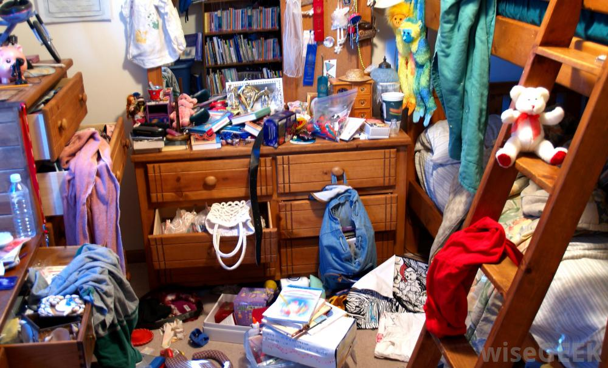
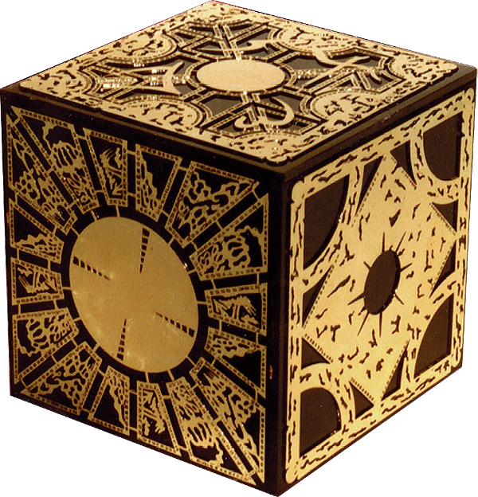
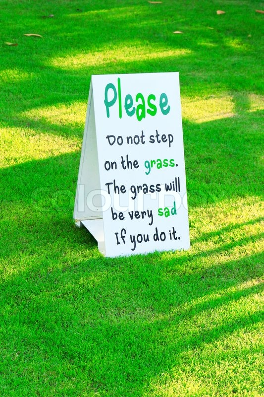

##! To JavaScript and Back

*Transfixing Tales of Transglotting Thefts*

<div>&nbsp;</div>

Yanick Champoux 

[yanick.champoux@iinteractive.com](mailto:yanick.champoux@iinteractive.com)

twitter: [@yenzie](https://twitter.com/yenzie)

## So I've been traveling the JS landscape

# 

## On the menu

* [Redux](http://redux.js.org) -> [Pollux][]
* [MobX](https://github.com/mobxjs/mobx) -> [MoobX][]
* JSX -> [Template::Caribou][]

[Pollux]: https://metacpan.org/release/Pollux
[MoobX]:  https://metacpan.org/release/MoobX
[Template::Caribou]:  https://metacpan.org/release/Template-Caribou


# Redux

## (also kinda)

* Flux
* VueX

## Goals

* Simplicity
* Consistency
* Predictability

## How?

* Centralize the state
* Once set, the state can't be changed
* Can't manipulate the state directly

## So, basically...


~ JavaScript ecosystem

# Centralized

#v Not



#v Instead



##v state = plain old data structure

    my $state = {
        players = {
            yenzie => { ships => [ 1 ] },
        },
        ships => [
            { name => 'Muscular Revenge', id => 1 },
        ]
    };

# Consistency

##v what's the problem?

    my $ship  = { id => 1, coords => [ 10, 10 ] };
    my $state = { ships => [ $ship ] };

    ...

    $state->{ships}[0]{coords}[0] = 20;

##v take II

    my $ship  = { id => 1, coords => [ 10, 10 ] };
    my $state = { ships => [ $ship ] };

    ...

    $ship->{coords} = [ 20, 20 ];

## cue in immutability

##v How does Redux does it? 

 

##v [Const::Fast](https://metacpan.org/release/Const-Fast)

    use Const::Fast;

    my $ship =  { id => 1, coords => [ 10, 10 ] };

    const my $store => { ships => [ $ship ] };

    ...

    $ship->{coords} = [ 20, 20 ]; # don't care

    $store->{ships}[0][0] = 12;   # nope, denied

## okay then, how do we modify states?

# Arrays

##v add

    @new = ( @old, 'foo' );

    @new = ( 'foo', @old );

##v remove

    # remove first

    @new = @old[1 ..$#old];

    (undef,@new) = @old;

    # remove last

    @new = @old[0 ..$#old-1];

##v remove head/tail chunk

    @new = before { $_ eq 'enough' } @old;

    @new = after { $_ eq 'enough' } @old;

##v [List::AllUtils](https://metacpan.org/releases/List-AllUtils)

List::Util / List::MoreUtils / List::UtilBy

##v remove specific element(s)

    @new = grep { is_keeper($_) } @old;

##v transform

    @new = map { do_things_to($_) } @old;

# Hashes

##v add or modify element(s)

    %new = ( %old, foo => 'bar' );

##v pick subset of elements

    %new = %old{ grep { is_keeper($_) } keys %old };

    %new = pairgrep { is_keeper($a) } %old;

##v transform

    %new = pairmap { do_things_to($a,$b) } %old;


## So we have a store we can't modify...

yay?

## Messaging


## Store + Message => Store


## Message

Type, Payload

    {
      type  => 'ADD_PLAYER',
      name  => 'yenzie',
    }

## message's mutation 

* Deterministic
* No side-effects

store_1 + message_1 = store_2

##v

   you ---> message ---> store

##v

   you ---> middleware --> message ---> store

##v

you --> m/w --> message ---> store --> observers 
   
   
^-------------------------------------------'

## Reducer

    $new_state = reducer( $old_state, $action );    

##v

```
my $store = {
    players = {
        yenzie => [ 1 ],
    },
    ships => [
        { name => 'Muscular Revenge', id => 1 },
    ]
};
```

##v 

```perl
{
    type  => 'ADD_PLAYER',
    name  => 'olaf',
}
```

##v

```perl
sub players_reducer($state,$action) {

    given ($action->{type}) {

        when( 'ADD_PLAYER' ) {
            return { 
                %$state,
                $action->{name} => []
            }
        }

        default { return $state };
  }

}
```

##v

```perl
sub ships_reducer($state,$action) {

    given ($action->{type}) {

        default { return $state };
  }

}
```

## 

```perl
{
	type  => 'ADD_SHIP',
	player => 'yenzie',
	id	 => 1,
	name  => 'Desperate Measure',
}
```

##

```perl
sub players_reducer($state,$action) {
  given ($action->{type}) {

	return { %$state,
	  $action->{name} => [] 
	} when 'ADD_PLAYER';

	return { 
		pairmap {
			$a => $a eq $action->{player} 
			? [ @$b, $action->{id} ] 
			: $b 
		} %$state 
	} when 'ADD_SHIP';

	default { return $state };
  }
}
```

##

```perl
sub ships_reducer($state,$action) {
  given ($action->{type}) {

	return [ 
		@$state,
		{ $action->%{ 'id', 'name' } }
	] when 'ADD_SHIP';

	default { return $state };
  }
}
```

##

```perl
sub main_reducer($state,$action) {
	return {
		players => players_reducer(
			$state->{players}, $action 
		),
		ships => ships_reducer(
			$state->{ships}, $action 
		),
	}
}
```

# Pollux

#v

```perl
use Pollux;
use Pollux::Action;

my $store = Pollux->new(
	reducer => {
		visibility_filter => \&visibility_filter,
		todos			 => \&todos
	},
);

```
##v

```perl
sub visibility_filter($action, $state = 'SHOW_ALL' ) {
	given ( $action ) {
		return $action->{filter} when $SetVisibilityFilter;

		default { return $state }
	}
}
```

##v

```perl
my $AddTodo = Pollux::Action->new( 'ADD_TODO', 'text' );
my $CompleteTodo = Pollux::Action->new(
  'COMPLETE_TODO', 'index'
);
my $SetVisibilityFilter = Pollux::Action->new(
  'SET_VISIBILITY_FILTER', 'filter'
);
```

#v

```perl
$store->dispatch($AddTodo->('Learn about actions'));
```

# MobX

## Reactive programming

#

```perl

my $hull = 10;

my $ship_status = $hull > 0 ? 'operative' : 'destroyed';

...

$hull -= 12;

```

#

```perl

has hull => (
  is => 'rw',
  trigger => sub($self,$new,$old) {
    $self->ship_status('destroyed') if $new <= 0;
  },
);
```

#

```perl

my $hull = 10;

my $ship_status = observer {
  $hull > 0 ? 'operative' : 'destroyed';
};

$hull -= 10;
```

# But how?

##

* Use PPI abd B::Deparse to inspect the code. 
* Figure out execution branching
* ...

## 

#

```perl

my $hull :Observable = 10;
my $engine :Observable = 20;
my $name :Observable = 'Resentful Retribution';

```

#

```perl
my $status = observer {
  return 'destroyed' if $hull <= 0;

  return 'damaged' if 5 > min $hull, $engine;

  return 'fully operational';
};

```

#

```perl
 # $hull = 10  ✋
 # $engine = 20 ✋
 # $name = 'RR'  

my $status = observer {
  return 'destroyed' if $hull <= 0;

  return 'damaged' if 5 > min $hull, $engine;

  return 'fully operational';
};

```

#

```perl
$hull $engine
  \	 /
	v  v
	$status
```


#

```perl
 # $hull = 10  ✋
 # $engine = 5 ✋
 # $name = 'RR'  

my $status = observer {
  return 'destroyed' if $hull <= 0;

  return 'damaged' if 5 > min $hull, $engine;

  return 'fully operational';
};

```

#

```perl
 # $hull = 0  ✋
 # $engine = 5 
 # $name = 'RR'  

my $status = observer {
  return 'destroyed' if $hull <= 0;

  return 'damaged' if 5 > min $hull, $engine;

  return 'fully operational';
};

```

## But how?

## With Moose Attributes?

Easy peasy

#

```perl

has hull => (
  is => 'rw',
  traits => [ 'Observable' ],
);

```

##

```perl

after initialize_instance_slot => sub {
	my( $self, $meta, $instance, $params ) = @_;

	$instance->meta->add_before_method_modifier(
		$self->get_read_method, sub {
			push @MoobX::DEPENDENCIES,
				[ $instance, $self->name ]
				if $MoobX::WATCHING;
		});

	$instance->meta->add_after_method_modifier(
		$self->get_write_method, sub {
			MoobX::changing_observable(
				[ $instance, $self->name ] 
			);
	});
};

```
#

```perl

has status => (
  traits => [ 'Observer' ],
  is => 'ro',
  lazy => 1,
  default => sub { ...  },
);

```

#v

```perl
sub around_observer {
    my $self = shift;

    local $MoobX::WATCHING = 1;
    local @MoobX::DEPENDENCIES = @MoobX::DEPENDENCIES;

    my $new_value = $self->default->();

    local $Carp::CarpLevel = 2;
    carp "MoobX observer doesn't observe anything"
        unless @MoobX::DEPENDENCIES;

    MoobX::dependencies_for( $self, @MoobX::DEPENDENCIES );

    return $new_value;
}
```


## without Moose?

## Tie!

#

```perl
package MoobX::Scalar; 

use Moose;

has value => (
    is     => 'rw',
    writer => 'STORE',
);

sub FETCH     { $_[0]->value }

sub TIESCALAR { $_[0]->new( value => $_[1]) }

```

#

```perl
package MoobX::Scalar::Observable;

use Moose::Role;

before 'FETCH' => sub($self) {
    push @MoobX::DEPENDENCIES, $self if $MoobX::WATCHING;
};

after 'STORE' => sub ($self) {
    MoobX::observable_ref($self->value) if ref $self->value;
    MoobX::observable_modified( $self );
};
```

#

```perl
sub Observable :ATTR(SCALAR) {
    my (undef, undef, $referent) = @_;

    MoobX::observable_ref($referent);
}
```

# 

```perl
sub observable_ref($ref) {
    my $type = reftype $ref;

    my $class = 'MoobX::'. ucfirst lc  $type || 'SCALAR';
    $class = with_traits( 
        map { use_module($_) }
        map { $_, $_ . '::Observable' } $class
    );
    if( $type eq 'SCALAR' ) {
        my $value = $$ref;
        tie $$ref, $class;
        $$ref = $value;
    }
    return $ref;
}
```

#

```perl
sub observer :prototype(&) {
    MoobX::Observer->new( generator => @_ ) 
}
```

#

```perl
package MoobX::Observer;

use overload '""' => sub { $_[0]->value };

use MooseX::MungeHas 'is_ro';

has generator => ( required => 1 );

has value => ( 
    builder => 1,
    lazy => 1,
    predicate => 1,
    clearer => 1,
);

```

#

```perl
sub _build_value {
    my $self = shift;

    local $MoobX::WATCHING = 1;
    local @MoobX::DEPENDENCIES = @MoobX::DEPENDENCIES;

    my $new_value = $self->generator->();

    local $Carp::CarpLevel = 2;
    carp "MoobX observer doesn't observe anything"
        unless @MoobX::DEPENDENCIES;

    MoobX::dependencies_for( $self, @MoobX::DEPENDENCIES );

    return $new_value;
}
```

# Template::Caribou

##

Most templating languages implement micro-languages to get around Perl's
scariness

# 

## But I like Perl!

## mason


## Template::Declare

## 

* purely perl
* for HTML/XML/SVG
* Moose-based, with roles and stuff
* DWIM to the hilt

##

```perl
package MyTemplate;

use Template::Caribou;

has name => ( is => 'ro' );

template main => sub($self) {
    say "hi " . $self->name;
};
```

##

```perl
say MyTemplate->new( name => 'Yanick' )->main;
```

##

```perl
use Template::Caribou::Tags::HTML ':all';

template main => sub($self) {
    $self->head_section; 
    $self->body_section;
};
```

##v 

```perl

template head_section => sub {
    head { 
        title { 'my title' };
    }
};

template body_section => sub($self) {
    body { "hi " . $self->name; }
};
```

## 

```perl
template body_section => sub($self) {
    body { 
        div { attr class => 'greeting';
            "hi " . $self->name; 
        }
    }
};

 # <div class="greeting">hi Yanick</div>
```

## 

```perl
use Template::Caribou::Tags 
    mytag => { -as => 'div_greeting', class => 'greeting' };

template body_section => sub($self) {
    body { 
        div_greeting {
            "hi " . $self->name; 
        }
    }
};

 # <div class="greeting">hi Yanick</div>
```

## T::C::Tags::HTML::Extended

#

```perl
 # <link rel="shortcut icon" href="blah.png" />

link {
    attr rel => 'shortcut icon', href => 'blah.png';
    return;
};
```
#

```perl
favicon 'blah.png';
```

#

```perl
link { attr rel =>'stylesheet', href => '...' };

script { attr src => '...' };
```

#

```perl
css_include 'public/blah.css';

javascript_include 'public/blah.js';
```

#

```perl

div {
    markdown q{
        ...and then I realized that I could 
        *totally* do without HTML!

        that felt 
    };
}

```

##

```perl

with 'Template::Caribou::Files';

```
